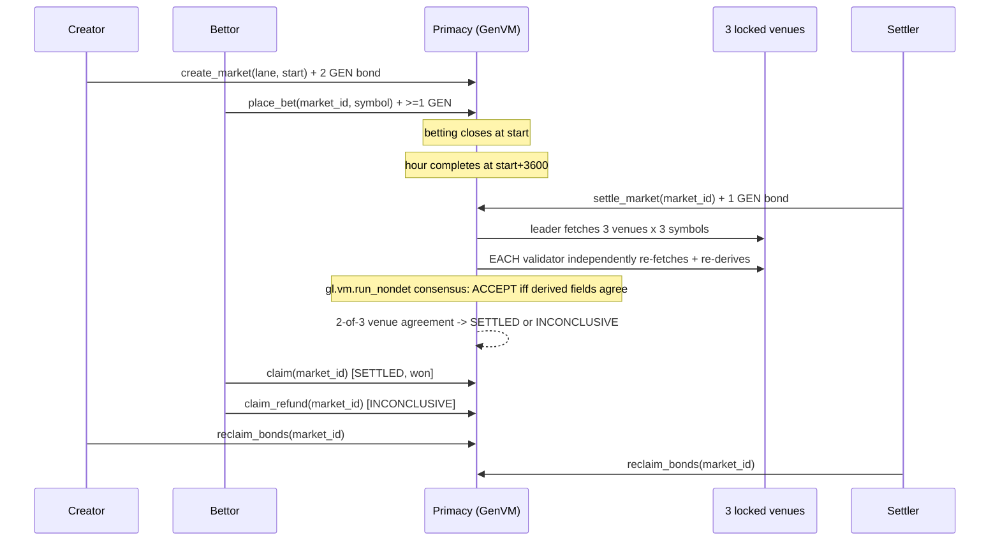

# PRIMACY

A permissionless hourly primacy market on GenLayer Studio Dev: three
comparable, 24/7 instruments race each completed UTC hour, and validators
independently fetch three locked venues to agree on which one had the
highest return.

- **Live demo**: _placeholder -- filled in after the frontend (Lovable)
  ships against this contract's ABI._
- **Contract address (Studio Dev, chain 61997)**: _placeholder -- filled
  in by `deploy/deploy.mjs`, see `deploy/deployments.json` after a real
  deploy._

## 1. The decision GenLayer owns

*"Which of three comparable instruments had the highest completed-hour
return across locked public venues?"*

Nothing about this is decidable off-chain by a single party without
trust: it requires fetching live data from multiple independent hosts,
deriving a consistent answer, and having a majority of independently
executing validators agree before any GEN moves. A GEN pool is staked on
the outcome and pays out based on it -- this is a real, adversarial,
on-chain consequence, not a display widget.

## 2. Who profits from a false verdict

A bettor who can make the contract record their symbol as the winner,
when it did not actually have the highest return, profits directly at
every other bettor's expense (parimutuel: losers' stake funds winners'
payout). The settler who successfully closes a market also earns a fee
cut, so there is a second, weaker incentive to bias settlement toward
*any* winner reaching quorum quickly rather than the correct one. Both
incentives are why settlement uses real GenVM consensus (`gl.vm.run_nondet`
with an independently-re-deriving validator) rather than trusting the
first caller's claimed outcome.

## 3. Constitution

| Constant | Value |
|---|---|
| Lanes | `CRYPTO_EQUITY_PROXIES` (MSTR, COIN, HOOD), `MAJORS` (BTC, ETH, SOL) |
| Hour window | `[start, start+3600)`, `start % 3600 == 0`, Unix seconds |
| `MIN_LEAD_SECONDS` | 1800 (30 min) |
| `MIN_BET` | 1 GEN |
| `CREATE_BOND` | 2 GEN |
| `SETTLE_BOND` | 1 GEN |
| `FEE_BPS` | 200 (2%) of settled winning pool only, 0% on refunds |
| Fee split | 50% successful settler, 50% treasury |
| `SETTLE_WINDOW_SECONDS` | 6 hours after hour end |
| `BPS_TOL` | 2 bps |
| Quorum | 2-of-3 venues must independently agree on the same winner |
| `MAX_OPEN_MARKETS_PER_CREATOR` | 8 |
| `MAX_PAGE_SIZE` | 50 |

All of the above are hardcoded Python module-level constants in
`contracts/primacy_lib.py`, immutable after deploy (no setter method
exists for any of them) -- exposed on-chain via `get_constitution()`.

## 4. Honest instrument definition

Every price used by this contract is:

> **USDT-M index return at locked venues for this completed UTC hour.**

Never "stock price," never "NYSE." `MSTR`/`COIN`/`HOOD` are USDT-margined
perpetual futures index candles on the three locked venues below, not
equities and not routed through any equities exchange. This wording is
used consistently in this README, in contract error strings, and in the
SDK/client -- see `docs/audit.md` for why this distinction is
load-bearing, not cosmetic.

## 5. Flow



## 6. Equivalence: must-agree vs may-differ vs abstain reasons

The leader and each validator independently fetch the same three locked
URLs and derive a canonical evidence object
(`contracts/primacy_lib.build_evidence`). Consensus is on **derived
fields**, never on raw HTTP bodies (`strict_eq` on raw JSON is explicitly
not used -- two genuinely correct fetches a few seconds apart will not
return byte-identical bodies).

`contracts/primacy_lib.compare_evidence` (unit-tested directly in
`tests/direct/test_primacy_lib.py::TestCompareEvidence`, 59 cases) is the
comparator a validator runs:

- **Must agree exactly**: overall `status` (`SETTLED`/`INCONCLUSIVE`),
  overall `winner` (or both `None`).
- **May differ, as long as the 2-of-3 outcome still matches**: any
  individual venue's vote, when one side abstained and the other did not
  -- an abstain is not evidence of disagreement, just a data gap.
- **May differ within tolerance**: each symbol's computed bps at a given
  venue, up to `BPS_TOL = 2` bps -- absorbs normal seconds-apart price
  drift between the leader's fetch and a validator's.
- **Abstain reasons** (a venue votes `None` for that hour, recorded in
  `abstain_reason`): `missing_body`, `malformed_candle`, `missing_close`,
  `decode_fail`, `zero_open`, `non_200`, `fetch_error`,
  `response_too_large`, `candle_not_closed` (bar still open), `tie`
  (exact bps tie among the lane's three symbols at that venue).
- **Malformed leader output is rejected before any comparison** --
  `is_well_formed()` checks required fields, enum membership, and that
  `status`/`winner` actually follow from `votes` under the 2-of-3 rule,
  before `compare_evidence` ever looks at bps tolerance.

## 7. Economics

- **Create bond** (2 GEN): returned to the creator once the market
  reaches a terminal state, *unless* it closed with zero bets, in which
  case it is slashed to treasury (anyone may permissionlessly trigger
  this once the market is terminal -- see `reclaim_bonds`).
- **Settle bond** (1 GEN): returned to whoever successfully called
  `settle_market`, regardless of outcome (SETTLED or INCONCLUSIVE both
  count as a successful settle).
- **Fee** (2% of the settled winning pool, SETTLED-with-a-winner only):
  split 50/50 between the settler and a fixed, immutable treasury
  address set at deploy time. Paid inline inside `settle_market`, not a
  separate claim step. Zero fee on refunds.
- **Payout math**: `payout = my_stake * (total_pool - fee) // winning_pool`,
  floor-divided; the claim that exhausts the winning pool's total staked
  amount receives the exact remainder instead of the floor-divided
  amount, so per-claim floor-division dust is never permanently stranded
  in the contract (see `primacy_lib.compute_claim_payout`, and
  `tests/direct/test_primacy_lib.py::TestComputeClaimPayout::test_last_claimant_absorbs_dust`).
- **All payouts are self-service and caller-derived**: `claim`,
  `claim_refund`, and `reclaim_bonds` all pay `gl.message.sender_address`
  -- the caller receives their own funds by calling the method
  themselves. The one exception is the treasury's fixed, immutable,
  deploy-time-constant half of the settlement fee and the zero-bet
  create-bond slash, both resolved to a fixed EOA the contract can never
  redirect. No method ever pays an address other than the caller or that
  one fixed constant. See `docs/architecture.md` for why this pattern
  was chosen over an IC-to-IC transfer.

## 8. Why not an EVM oracle / why not Dominion

An EVM price-feed oracle (Chainlink-style) reports a single agreed value
that consumers trust by construction -- it does not itself decide
anything adversarial, and a wrong report is a data-quality bug, not a
contract exploit. PRIMACY's *entire reason to exist on GenLayer* is that
the decision -- "which of three symbols actually won" -- is exactly the
kind of judgment GenVM's Equivalence Principle is for: multiple
independent parties fetching real data and reaching consensus on a
*derived* conclusion, not a single trusted number.

This project is a from-scratch build against jason4185/dominion as prior
art, not a fork or a reskin. Dominion's real reference value was its
publicly documented review findings, both incorporated directly here:

- **Dominion HIGH #1** (payouts via IC-to-IC `emit_transfer`, not
  reliably deliverable to a real EOA the way this project's pattern is):
  fixed by making every payout self-service and caller-derived (§7) --
  no method here ever resolves a payout target from stored state other
  than the fixed treasury constant.
- **Dominion's leftover medium finding** (a favorable leader result
  against one witness set treated as immune to a different, equally
  valid witness set reaching a different conclusion): fixed by requiring
  the *derived* evidence object -- not the raw witness data -- to be what
  validators reconcile on, with an explicit tolerance and abstain-aware
  2-of-3 rule (§6), so two honest fetches with different raw JSON but the
  same real-world answer still settle correctly instead of spuriously
  disagreeing.

## 9. Network (Studio Dev only)

| Key | Value |
|---|---|
| Label | Studio Next / Studio Dev |
| Chain ID | 61997 |
| RPC | `https://studio-dev.genlayer.com/api` |
| Explorer | `https://explorer-studio-dev.genlayer.com` |
| Currency | GEN (18 decimals) |

**State may reset.** Studio Dev is a preview network; a market created
in one session is not guaranteed to exist later. Never hardcode a market
id or address from a prior session in tests, docs, or the frontend.

This project never targets studionet (chain 61999), Bradbury (4221), or
any hash/address associated with Dominion's own deployment.

## 10. Methods

**Views** (16): `get_constitution`, `get_config`, `get_lanes`,
`get_lane`, `get_market`, `get_markets`, `get_open_markets`, `get_board`,
`get_betting_state`, `get_user_position`, `get_user_positions`,
`get_claimable_markets`, `get_source_evidence`, `get_user_activity`,
`get_keeper_stats`, `get_market_by_lane_start`.

**Writes** (6): `create_market` (payable, `CREATE_BOND`), `place_bet`
(payable, `>= MIN_BET`), `settle_market` (payable, `SETTLE_BOND`),
`claim`, `claim_refund`, `reclaim_bonds`.

Full signatures: `contracts/Primacy.py`. `UserError` strings are stable,
lowercase, and frontend-parseable -- see `frontend/src/lib/primacy/errors.ts`.

## 11. Tests

```bash
python -m pytest tests/direct -q                    # 96 tests, no network needed
PYTHONIOENCODING=utf-8 genvm-lint check contracts/build/Primacy.deploy.py
python contracts/build_bundle.py                     # rebuild + print size vs 52,224-byte ceiling
gltest tests/integration -v                          # live Studio Dev, needs a funded key -- see tests/integration/README.md
```

Current status (this repo, this commit): 96/96 direct tests pass (59
pure-Python `primacy_lib` unit tests + 37 contract-level `gltest`
direct-mode tests), `genvm-lint check` clean, bundle size well under the
Bradbury-observed ~52-54KB deploy-size ceiling (see `docs/architecture.md`
for the exact current byte count -- re-run `build_bundle.py` for the
live figure, since it changes whenever the contract does).

## 12. Deploy runbook (Studio Dev)

```bash
cp .env.example .env        # fill in DEPLOYER_PRIVATE_KEY and TREASURY_ADDRESS
python contracts/build_bundle.py
node deploy/deploy.mjs
```

Writes the deployed address into `deploy/deployments.json`. See
`deploy/deploy.mjs`'s own header comment for the exact `genlayer-js`
`studioDevnet` chain preset usage and fee-estimation flow.

## 13. Agent API

Read-only Next.js API routes over `genlayer-js`'s read client (no
account, no provider -- see `frontend/src/lib/primacy/networks.ts`):

- `GET /api/health` -- rpc reachability, chain id, contract address, code
  presence, last error.
- `GET /api/constitution`
- `GET /api/board`
- `GET /api/markets/:id`
- `GET /api/markets/:id/evidence`

## 14. Known platform limits

- **Studio Dev has no full EVM ghost layer for arbitrary transfers.**
  Every payout in this contract is caller-derived (self-service claim)
  or a fixed deploy-time constant (treasury) for exactly this reason --
  see §7 and `docs/architecture.md`.
- **`gl.nondet.web.get` response redirect/retry metadata is not
  independently inspectable from contract code** -- the contract sees
  only `{status, headers, body}` for the final response; if a locked
  venue silently redirects to a materially different payload, that is
  indistinguishable from the venue's real response at the contract
  level. Locking the exact host + path constants (not accepting any
  caller-supplied URL) is the primary mitigation.
- **gltest direct-mode cannot exercise `run_nondet`'s validator_fn at
  all** (see `tests/direct/conftest.py` and `docs/architecture.md`) --
  the equivalence comparator is proven as pure-Python unit tests instead,
  and real validator consensus is only observable live (see
  `tests/integration/README.md`).
- **`gl.message.raw["datetime"]` is not warp-responsive in this pinned
  gltest version's direct-mode mock** (confirmed by reading
  `gltest/direct/vm.py`'s `_refresh_gl_message`); `datetime.now(timezone.utc)`
  is used instead, which the mock *does* make warp-aware, and which is
  independently confirmed live-safe (GenVM pins Python's wall clock to
  the transaction's own deterministic datetime).

## 15. What we refused to ship

- Any lane mixing instrument classes or trading sessions (e.g. NYSE-hours
  equities alongside 24/7 perps) -- V1 ships only same-class, same-session
  lanes.
- A caller-supplied evidence/price URL of any kind -- all three venues
  are locked host+path constants.
- `strict_eq` on raw venue JSON as the equivalence mechanism.
- Any admin pause or seize path -- constants are immutable post-deploy,
  and every escape hatch (the settle-window fallback, the zero-bet
  create-bond slash) is permissionless and bounded, never
  operator-triggered.
- Frontend pixels -- this repo ships the protocol, the typed SDK, and a
  health-check-only API surface; visual design is a separate, later
  Lovable pass against this contract's ABI.
